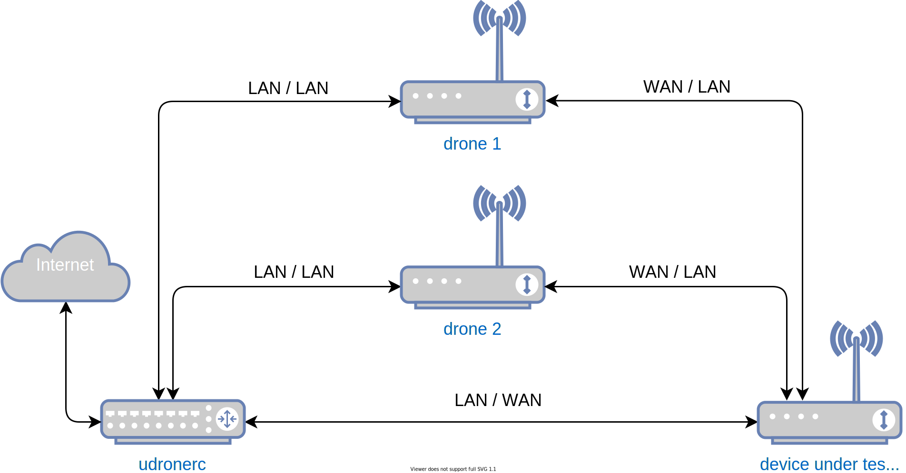

# Test setup

The following will guide through setting up two kinds of development
environments. The primer is for local development of `udrone` only as the
running node is emulated with limited capabilities (No WiFi, no WAN interface).
The second setup requires a total of four devices of which (at least) three run
OpenWrt. The second setup allows real device testing.

Before explaining the setup itself basic steps are described to setup drones.

## Compiling `udrone` client package

Add the `feed-prpl` to you local build environment. See the
[README.md](https://git.prpl.dev/prplwrt/feed-prpl) on how to do so.

Install the `udrone` package by running `./scripts/feeds install udrone` in your
local build environment.

Compile the package alone via `make package/udrone/compile`.

The package is found in an architecture specific folder in
`./bin/packages/<arch>/feed-prpl/`. Install the package on your drones.

## Local setup

The local setup runs a single *drone* within a Docker container which is
controllable via the developers host computer. This setup does not include a
device of testing (DOT) and it's only purpose is to see if the `udrone` client
software and `udronerc` remote controller work as expected.

### Development drone

To compile a development drone run `make menuconfig` and select the `x86/64`
architecture. Select the `udrone` package in the `Development` section.

Once compiled you can run the node within a docker container using the
`docker-run-rootfs.sh` script.

	./scripts/docker-run-rootfs.sh --network

Be sure to enable the network via `--network` else the node has no attached
network interfaces to communicate with the controller.

Run `ps` in the opened terminal to verify `udrone` is started. Alternatively it
is possible to run the following two command to get all `udrone` status messages
printed to _stdout_:

	/etc/init.d/udrone stop
	udrone eth0

### Remote controller setup

The remote controller is a Python package with some dependencies outside the
Python standard library. It is installable via the following commands which
automatically install all required packages:

	git clone https://github.com/aparcar/udronerc.git
	cd udronerc/
	python3 -m venv .
	source ./bin/activate
	pip install -e .

Using the `pip install -e .` installs `udronerc` in the current folder allowing
to perform changes without the need of reinstalling the package.

## Four device setup

